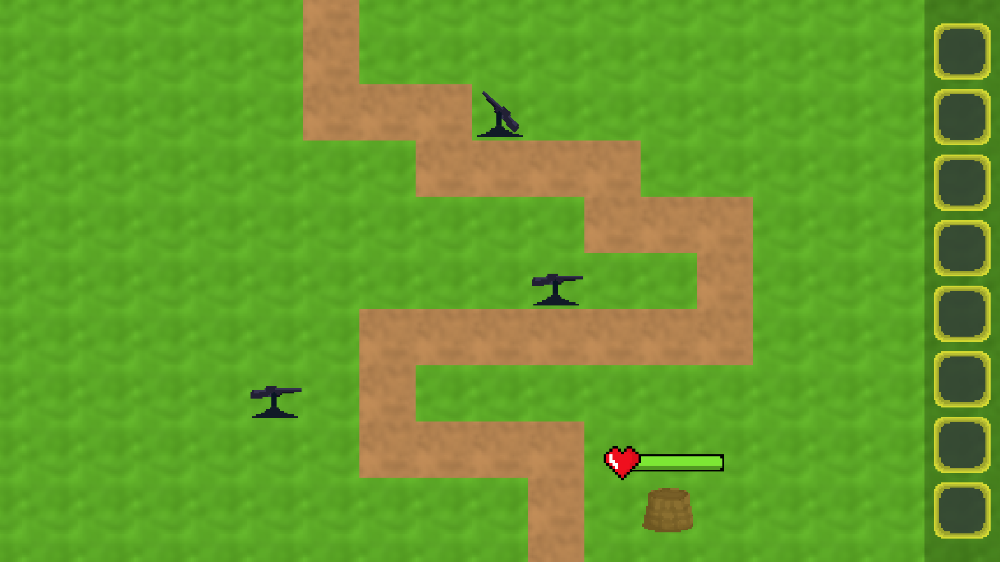
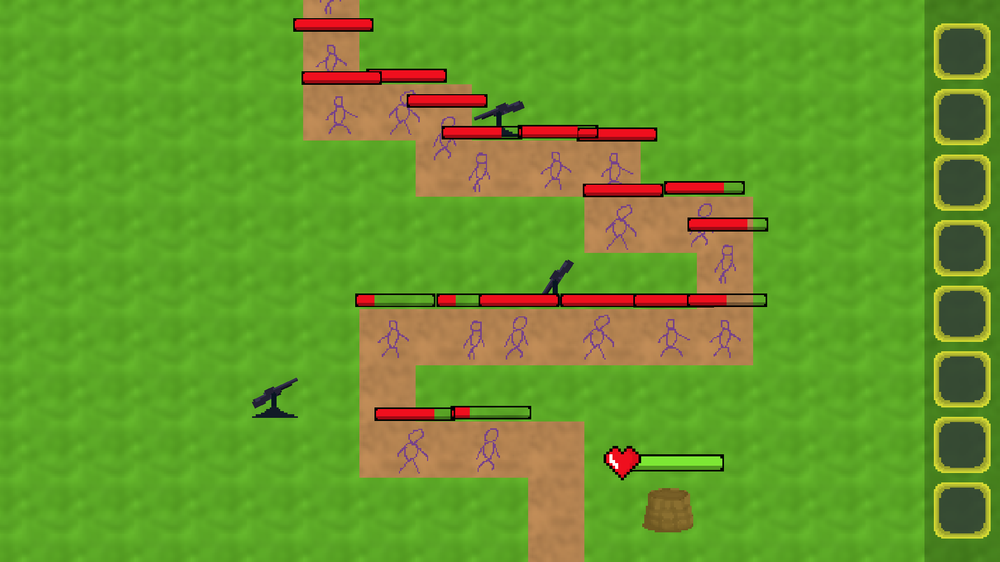
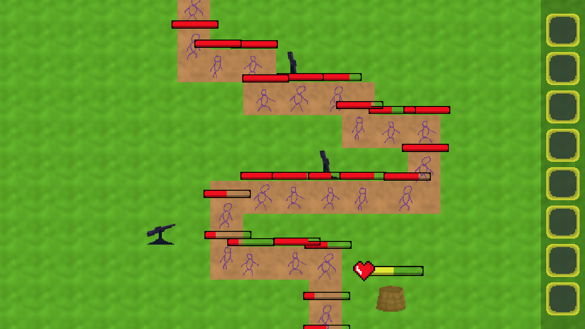
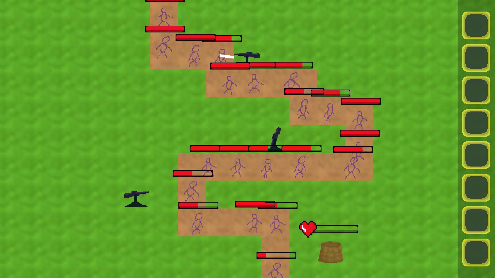

# Transmission

Making a tower defense game.

## About

For now there are enemies that go down the road and turrets that shoot them. When an enemy gets to the end the players base takes damage. When player loses all HP the game stops.
Levels loading from a picture where each pixel represents a certain item/tile

**Work in progress!**

Implementing pick and place system for turrets.

## Running

Executable file is located in bin folder: ``` bin/Transmission.exe ```

## Screenshots






